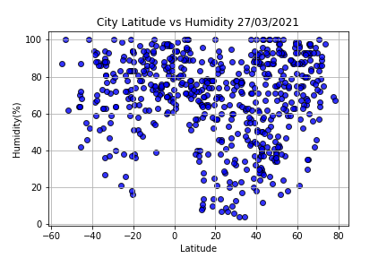
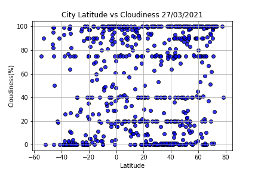

# Python-API-Challenge

## Background

Whether financial, political, or social -- data's true power lies in its ability to answer questions definitively. So let's take what you've learned about Python requests, APIs, and JSON traversals to answer a fundamental question: "What's the weather like as we approach the equator?"

Now, we know what you may be thinking: _"Duh. It gets hotter..."_

But, if pressed, how would you **prove** it?

## Part I - WeatherPy

In this example, you'll be creating a Python script to visualize the weather of 500+ cities across the world of varying distance from the equator. To accomplish this, you'll be utilizing a [simple Python library](https://pypi.python.org/pypi/citipy), the [OpenWeatherMap API](https://openweathermap.org/api), and a little common sense to create a representative model of weather across world cities.

Your first requirement is to create a series of scatter plots to showcase the following relationships:

* Temperature (F) vs. Latitude
* Humidity (%) vs. Latitude
* Cloudiness (%) vs. Latitude
* Wind Speed (mph) vs. Latitude

After each plot add a sentence or too explaining what the code is and analyzing.

Your second requirement is to run linear regression on each relationship, only this time separating them into Northern Hemisphere (greater than or equal to 0 degrees latitude) and Southern Hemisphere (less than 0 degrees latitude):

* Northern Hemisphere - Temperature (F) vs. Latitude
* Southern Hemisphere - Temperature (F) vs. Latitude
* Northern Hemisphere - Humidity (%) vs. Latitude
* Southern Hemisphere - Humidity (%) vs. Latitude
* Northern Hemisphere - Cloudiness (%) vs. Latitude
* Southern Hemisphere - Cloudiness (%) vs. Latitude
* Northern Hemisphere - Wind Speed (mph) vs. Latitude
* Southern Hemisphere - Wind Speed (mph) vs. Latitude

After each pair of plots explain what the linear regression is modeling such as any relationships you notice and any other analysis you may have.

Your final notebook must:

* Randomly select **at least** 500 unique (non-repeat) cities based on latitude and longitude.
* Perform a weather check on each of the cities using a series of successive API calls.
* Include a print log of each city as it's being processed with the city number and city name.
* Save a CSV of all retrieved data and a PNG image for each scatter plot.

### Part II - VacationPy

Now let's use your skills in working with weather data to plan future vacations. Use jupyter-gmaps and the Google Places API for this part of the assignment.

* **Note:** Remember that any API usage beyond the $200 credit will be charged to your personal account. You can set quotas and limits to your daily requests to be sure you can't be charged. Check out [Google Maps Platform Billing](https://developers.google.com/maps/billing/gmp-billing#monitor-and-restrict-consumption) and [Manage your cost of use](https://developers.google.com/maps/documentation/javascript/usage-and-billing#set-caps) for more information.

* **Note:** if you having trouble displaying the maps try running `jupyter nbextension enable --py gmaps` in your environment and retry.

* Create a heat map that displays the humidity for every city from the part I of the homework.

  

* Narrow down the DataFrame to find your ideal weather condition. For example:

  * A max temperature lower than 80 degrees but higher than 70.

  * Wind speed less than 10 mph.

  * Zero cloudiness.

  * Drop any rows that don't contain all three conditions. You want to be sure the weather is ideal.

  * **Note:** Feel free to adjust to your specifications but be sure to limit the number of rows returned by your API requests to a reasonable number.

* Using Google Places API to find the first hotel for each city located within 5000 meters of your coordinates.

* Plot the hotels on top of the humidity heatmap with each pin containing the **Hotel Name**, **City**, and **Country**.

  

# Some Observations and Visualisations

## 1st Observable Trend: Latitude vs Max Temperature

From the 'City Latitude vs Max Temperature' graph, we can observe a concave relationship between latitude and maximum temperature. More specifically the maximum temperature of a city rises as the latitude of the city increase. Until it reaches the turning point several degrees past the equator, moving into the northern hemisphere. From then, the maximum temperature now decreases as latitude increases. 

This observation in trend is consistent with the common knowledge that expected maximum temperature generally does decrease the further you go away from the equator. This is can be scientifically explained with multiple culminating factors that allow for more consistent, less spread out and intense sunlight nearer to the equator. Such as the Earth's curvature, axial tilt, atmosphere, and ocean currents.

## 2nd Observable Trend Latitude vs Humidity Regression

From both the output of the Northern and Southern Hemisphere Latitudes vs Humidity Regression codes, we can observe that as latitude increases so does humidity. In more detail, past the equator, as latitude increases by 1 degree, humidity will rise by 0.15%. The R value or correlation coefficient posits a weak positive correlation. While in the southern hemisphere, as latitude increases by 1 degree humidity will increase by 0.25% with a weak to moderate positive correlation.

One would hypothesise that humidity would be higher in warmer climates/temperatures. With warmer climates usually existing near the equator as previously noted. Therefore, the relationship observed from the southern hemisphere regression is expected, but not with the northern hemisphere. As latitude increases while inside the northern hemisphere, you are leaving the equator and should expect humidity to fall because of it. An unobserved weather shock on the day of data collection could explain the unexpected observation, or more likely a symptom of the biased sample selection method when finding cities. The algorithm to find cities does bias towards coastal cities because randomised geo coordinates are most likely to hit sea. Coastal cities do logically have more humidity compared to landlocked cities.

## 3rd Observation Trend Latitude vs Cloudiness Regression

From both the output of the Northern and Southern Hemisphere Latitudes vs Cloudiness Regression codes, we can observe that as latitude increases so does cloudiness. In more detail, past the equator, as latitude increases by 1 degree, humidity will rise by 0.23%. This R value or correlation coefficient suggests a weak positive correlation. While in the southern hemisphere, as you approach the equator as latitude increases by 1 humidity will increase by 0.58% with a moderate to strong positive correlation. 

The presence of clouds would hypothetically be highly correlated with humidity as moisture is needed to create clouds. Thus, similarly to humidity, we would expect cloudiness to fall as you left the equator. Similarly to the latitude vs humidity graphs, we find that data from the southern hemisphere is consistent with expectation and the northern hemisphere data is not. Due to the hypothesised degree of correlation between humidity and clouds we can explain for the unexpected observation using the same reasoning. Being weather shocks and biased sampling methodology.

### For more indepth analysis please look into the ipynb files

